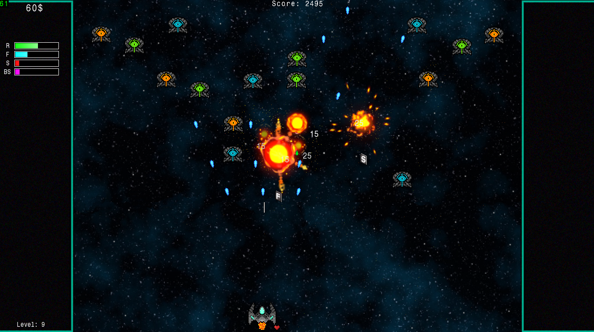

# SimpleSpaceShooter
My attempt to make a simple, enjoyable minigame using C++ and SFML library. I got inspired by another 2D space
shooter called Warblade which I used to play a lot as a child, be sure to check it out :space_invader:

You can watch a quick gameplay [here](https://youtu.be/ys475QWXbcY) :poop:

          

## Built with
* SFML - Basically everything
* SimpleGameFramework - My own sfml framework I used to make the core of the game

## Sources
Here are the sources to things i did not make by myself:\
Sprites:
* [Explosions1](https://sinestesia.itch.io/2d-explosions-animations)
* [Explosions2](https://sinestesia.itch.io/free-2d-explosion-animations-2)

Audio:
* [music](https://gooseninja.itch.io/space-music-pack)
* [blaster1](https://freesound.org/people/Theogobbo/sounds/397473/)
* [blaster2](https://freesound.org/people/MikeE63/sounds/466867/)
* [blaster3](https://freesound.org/people/MikeE63/sounds/466868/)
* [pickup](https://freesound.org/people/Scrampunk/sounds/345297/)
